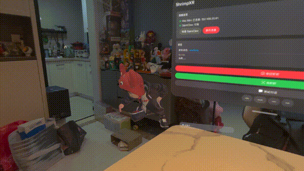

# 🦐 VisionClaw — Your AI Companion on Apple Vision Pro

**English** | [中文](README_CN.md)

**VisionClaw** brings an interactive 3D AI character to your Apple Vision Pro. A lively animated character sits on your desk, listens to your voice, talks back with real speech, and connects to your Mac's AI brain — all in mixed reality.

> *"Like having a tiny AI assistant living on your desk, with personality."*

### 🎥 Demo

[](https://github.com/lhfer/visionclaw/releases/download/v0.1.0/demo.mp4)

*Click the preview to watch the full demo video*

---

## ✨ Features

### 🎭 Living 3D Character
- **15+ hand-crafted animations** — idle, listening, thinking, working, celebrating, sleeping, and more
- **Reactive state machine** — the character visually responds to every interaction stage
- **Gesture control** — drag to reposition, pinch to scale, two-hand rotate to turn
- **Always alive** — idle variations, easter egg dances, drowsy yawns, and sleep cycles

### 🎤 Voice Interaction
- **Tap to talk** — tap the character to start listening, tap again to send
- **Real-time transcription** — see your words appear in a floating speech bubble as you speak
- **Chinese speech recognition** — powered by Apple's on-device `SFSpeechRecognizer`
- **Text-to-speech responses** — the character speaks back with natural Chinese TTS

### 💬 AI-Powered Conversations
- **OpenClaw integration** — connects to your Mac Mini running the OpenClaw AI agent via WebSocket
- **Auto-discovery** — finds your Mac on the local network via Bonjour
- **Live status feedback** — see thinking, working, and processing states in real-time
- **Progressive timeout** — clear feedback at 10s, 30s, 60s if the AI takes long

### 🫧 Smart Speech Bubble
- **Typewriter effect** — responses appear character by character with adaptive speed
- **Chinese-optimized** — slower display for Chinese characters, faster for English, pauses on punctuation
- **State icons** — 🎤 listening, ✨ sending, 💭 thinking, ⚙️ working, ✓ success, ⚠️ error
- **Auto-dismiss** — generous reading time calculated for Chinese reading speed (~3 chars/sec)

### 🏠 Spatial Awareness
- **Mixed reality** — character exists in your real environment with shadows
- **Free positioning** — drag the character anywhere in 3D space (horizontal + vertical)
- **Pinch to resize** — scale from tiny (1cm) to large (60cm)
- **Billboard bubble** — speech bubble always faces you automatically

---

## 🏗 Architecture

```
Apple Vision Pro                          Mac Mini
┌─────────────────────┐                  ┌──────────────────┐
│  VisionClaw App     │  ◄──WebSocket──► │  OpenClaw Bridge │
│                     │                  │  (Python)        │
│  ┌───────────────┐  │                  │  ┌────────────┐  │
│  │ ShrimpEntity  │  │   Bonjour        │  │  OpenClaw   │  │
│  │ (3D Character)│  │   Discovery      │  │  AI Agent   │  │
│  ├───────────────┤  │                  │  └────────────┘  │
│  │ AnimController│  │                  └──────────────────┘
│  │ (15+ anims)   │  │
│  ├───────────────┤  │
│  │ SpeechManager │  │
│  │ (STT + TTS)   │  │
│  ├───────────────┤  │
│  │ Bubble3D      │  │
│  │ (SwiftUI in   │  │
│  │  RealityKit)  │  │
│  └───────────────┘  │
└─────────────────────┘
```

### Key Components

| Component | File | Purpose |
|-----------|------|---------|
| `ShrimpEntity` | `ShrimpEntity.swift` | 3D model loading, dual-entity hierarchy (root wrapper + animated model) |
| `ShrimpAnimationController` | `ShrimpAnimationController.swift` | 15+ animation clips, state-driven transitions, idle variations |
| `ShrimpAnimationSystem` | `ShrimpAnimationSystem.swift` | RealityKit ECS system for per-frame updates + bubble positioning |
| `ShrimpBubble3D` | `ShrimpBubble3D.swift` | ViewAttachmentComponent-based 3D speech bubble with typewriter |
| `SpeechManager` | `SpeechManager.swift` | SFSpeechRecognizer (async audio setup) + AVSpeechSynthesizer |
| `SessionManager` | `SessionManager.swift` | Central state machine orchestrating all interactions |
| `NetworkManager` | `NetworkManager.swift` | Bonjour discovery + WebSocket to Mac Mini |
| `OpenClawBridge` | `bridge.py` | Python WebSocket bridge between Vision Pro and OpenClaw |

---

## 🚀 Getting Started

### Prerequisites

- **Apple Vision Pro** (or visionOS Simulator)
- **Xcode 26+** with visionOS 26 SDK
- **Mac Mini** (or any Mac) running the OpenClaw bridge (for AI features)
- **Microphone permission** granted to the app

### 1. Clone & Open

```bash
git clone https://github.com/lhfer/visionclaw.git
cd visionclaw
open ShrimpXR.xcodeproj
```

### 2. Build & Run

1. Select `Apple Vision Pro` target (device or simulator)
2. Build & Run (⌘R)
3. The control panel window appears

### 3. Connect to AI

1. Start the OpenClaw bridge on your Mac:
   ```bash
   cd OpenClawBridge
   pip install -r requirements.txt
   python bridge.py
   ```
2. In VisionClaw, tap **"搜索 Mac Mini"** to auto-discover via Bonjour
3. Status turns green when connected

### 4. Meet Your Character

1. Tap **"放出虾虾"** to spawn the character
2. The character appears on your desk with a greeting animation
3. **Tap the character** to start voice input
4. **Speak in Chinese** — see real-time transcription in the bubble
5. **Tap again** to send your message to the AI
6. Watch the character react — casting spell → thinking → celebrating!

### 5. Gesture Controls

| Gesture | Action |
|---------|--------|
| **Tap** | Start/stop voice recording |
| **Long press** | Force character upright |
| **Drag** | Move character in 3D space |
| **Pinch** | Scale character size |
| **Two-hand rotate** | Rotate character facing |

---

## 🎬 Animation States

The character has a rich animation state machine:

| State | Animation | Trigger |
|-------|-----------|---------|
| `idle` | Breathing, walking, random poses | Default state |
| `listening` | Focused attention | User taps to speak |
| `sendingCommand` | Casting spell ✨ | Voice input sent |
| `thinking` | Walking/pacing | AI is processing |
| `working` | Active work gestures | AI is executing |
| `success` | Victory dance 🎉 | AI response received |
| `error` | Defeat pose | Something went wrong |
| `sleeping` | Napping 💤 | 2 min inactivity |

---

## 📁 Project Structure

```
ShrimpXR/
├── Sources/
│   ├── App/
│   │   ├── ShrimpXRApp.swift          # App entry, ECS registration
│   │   ├── ControlPanelView.swift     # Settings & debug UI
│   │   └── SessionManager.swift       # Central state orchestration
│   ├── Shrimp/
│   │   ├── ShrimpEntity.swift         # 3D model loading & placement
│   │   ├── ShrimpAnimationController.swift  # Animation state machine
│   │   ├── ShrimpAnimationSystem.swift      # ECS per-frame system
│   │   ├── ShrimpBubble3D.swift       # 3D speech bubble
│   │   ├── ShrimpImmersiveView.swift  # Main XR view + gestures
│   │   └── ShrimpState.swift          # State definitions
│   ├── Speech/
│   │   └── SpeechManager.swift        # STT + TTS
│   └── Network/
│       └── NetworkManager.swift       # Bonjour + WebSocket
├── Resources/
│   ├── shrimpboy.usdz                 # Main character model
│   └── animations/                    # 15+ USDZ animation files
└── OpenClawBridge/
    ├── bridge.py                      # WebSocket bridge server
    └── requirements.txt
```

---

## 🛠 Technical Highlights

- **Dual-entity hierarchy**: Wrapper entity (gestures/rotation) → Model entity (animations). Prevents animation root motion from conflicting with user gestures.
- **Async audio setup**: `AVAudioEngine` initialization runs off MainActor via `nonisolated static func` to prevent UI freezing on Vision Pro.
- **ViewAttachmentComponent**: Native visionOS 26 API for rendering SwiftUI directly in 3D space as speech bubbles.
- **BubblePositionComponent**: Custom RealityKit ECS component that dynamically tracks the character's head joint and counter-scales to maintain readable text size regardless of character scale.
- **Swift 6 strict concurrency**: Full compliance with Swift's latest concurrency model.

---

## 📄 License

MIT License — see [LICENSE](LICENSE) for details.

---

## 🤝 Contributing

Contributions are welcome! Feel free to open issues or submit pull requests.

---

<p align="center">
  Built with ❤️ for Apple Vision Pro<br>
  <strong>VisionClaw</strong> — AI meets spatial computing
</p>
